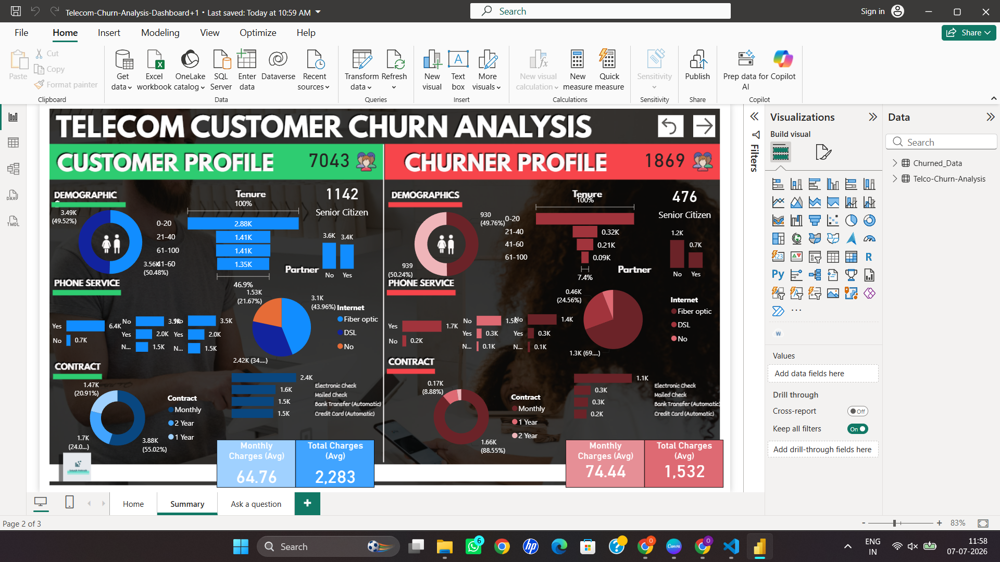

# Telecom Customer Churn Analysis

##  Project Overview

This project analyzes telecom customer churn using **SQL, Python (Pandas, NumPy)** and **Power BI** to identify key factors influencing customer attrition and provide actionable business insights through interactive dashboards.

---

## Tech Stack

- SQL
- Python
- Pandas
- NumPy
- Power BI
- Excel

---

## Project Workflow

- Data Collection
- Data Cleaning
- Feature Engineering
- Exploratory Data Analysis (EDA)
- Dashboard Development
- Business Insights

---

##  Dashboard Preview



---

##  Key Business Insights

- Customers with **Month-to-Month** contracts have the highest churn rate.
- Customers with **shorter tenure** are more likely to churn.
- **Electronic Check** users exhibit significantly higher churn.
- **Fiber Optic** customers show higher churn than DSL customers.

---

##  Repository Structure

```
customer-churn-analysis
│
├── Customer_Churn_Dashboard.pbix
├── Customer_Churn_Analysis.ipynb
├── Telco_Customer_Churn.csv
├── dashboard.png
└── README.md
```

---

##  Future Improvements

- Develop machine learning models for churn prediction.
- Deploy dashboards using Power BI Service.
- Automate data pipelines for real-time reporting.
